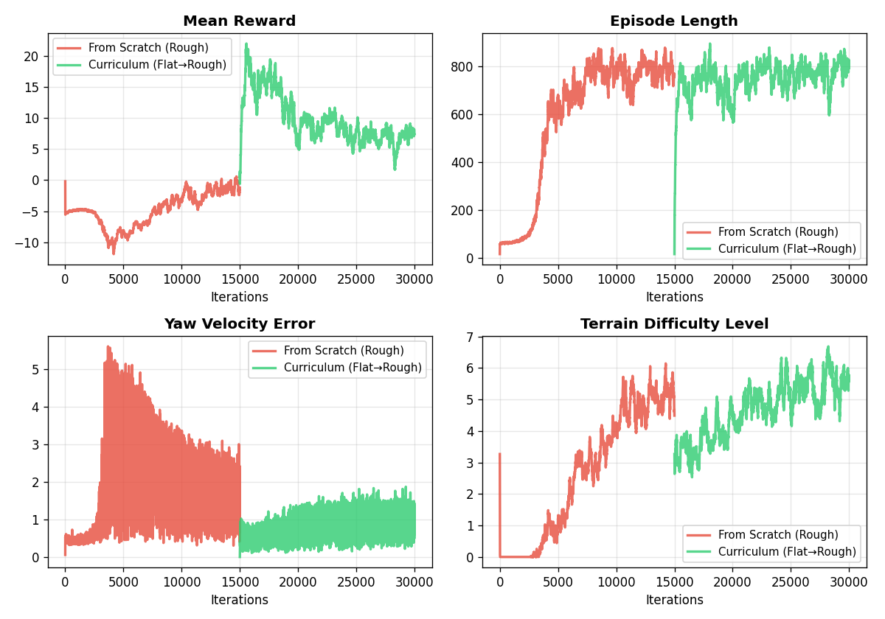

# 🤖 Project 01: H1人形机器人 Locomotion Reward优化与课程学习

## 📌 项目简介

基于 **IsaacLab 2.3.2 + Isaac Sim 5.1.0** 平台，使用 **PPO** 算法训练宇树 H1 人形机器人的行走任务。项目包含两部分工作：

🎯 **Part 1 — Reward调优**：通过系统性的reward权重实验，总奖励提升 **68%**，摔倒率从 3.1% 降至 **0%**

🎯 **Part 2 — 课程学习**：验证"先平地后复杂地形"的迁移训练策略，reward **由负转正**，地形难度提升 **28%**

---

## 🖥️ 环境信息

| 项目 | 配置 |
|------|------|
| GPU | NVIDIA RTX 4060 Laptop (8GB) |
| 系统 | Ubuntu 22.04 |
| 框架 | IsaacLab 2.3.2 + Isaac Sim 5.1.0 |
| 算法 | PPO (rsl-rl-lib 3.0.1) |
| 并行环境数 | 32 |
| 每组实验迭代次数 | 15,000 |
| 单次训练时间 | ~1.5小时 |

---

## Part 1：Reward 调优实验

### 🔍 问题发现

默认配置下训练完成后，观察到以下问题：

- **转向跟踪误差较大**：`error_vel_yaw = 0.62`，机器人对转向指令的跟踪能力不足
- **线速度跟踪仍有改善空间**：`error_vel_xy = 0.32`
- **躯干姿态缺乏约束**：默认配置没有对机器人的站立高度进行显式约束

### 🧪 实验设计

**实验A — Baseline**：IsaacLab 默认 H1 flat 环境参数

**实验B — 提高转向权重**：将 `track_ang_vel_z_exp` 权重从 `1.0` → `2.0`

```python
# 默认
track_ang_vel_z_exp = RewTerm(weight=1.0, ...)
# ✅ 修改后
track_ang_vel_z_exp = RewTerm(weight=2.0, ...)
```

**实验C1 — 加入高度惩罚（⚠️ 过强）**：新增 `base_height_l2`，权重 **-1.0**

**实验C2 — 加入高度惩罚（✅ 适中）**：权重降低至 **-0.2**

```python
base_height = RewTerm(
    func=mdp.base_height_l2,
    weight=-0.2,           # ✅ C1用-1.0过强，降到-0.2效果最佳
    params={"target_height": 0.98},
)
```

### 📊 实验结果

| 指标 | Baseline | 实验B | 实验C1 ⚠️ | 实验C2 ✅ |
|------|----------|-------|-----------|-----------|
| Mean Reward | 24.32 | 39.17 | 25.13 | **🏆 40.93** |
| error_vel_yaw | 0.6171 | 0.4932 | 0.7328 | **0.5037** |
| error_vel_xy | 0.3200 | **0.2177** | 0.3642 | 0.3065 |
| 摔倒率 | 3.1% | 3.1% | ❌ 20.1% | **✅ 0%** |
| Episode Length | 973 | 990 | 919 | **992** |

### 训练曲线

<p align="center">
  
</p>

### 回放演示（实验C2 最佳配置）

<p align="center">
  
</p>
### 💡 关键发现

#### ⭐ 发现一：转向权重不足是主要瓶颈

将转向权重从 1.0 提高到 2.0，转向误差下降 **20%**，总奖励提升 **61%**。说明默认配置中转向 reward 相对不足。

#### ⭐ 发现二：Reward权重平衡 > 单项权重大小

这是本项目**最核心的发现**：

| 高度惩罚权重 | 效果 |
|-------------|------|
| ❌ **-1.0（过强）** | 摔倒率从 3% 飙升至 **20%**，所有指标全面下降 |
| ✅ **-0.2（适中）** | 摔倒率降至 **0%**，reward达到最高 **40.93** |

> 📝 **结论**：过强的惩罚会破坏reward各项之间的平衡，导致策略在多个目标之间无法有效权衡。Reward设计的核心不是让某一项更强，而是找到各项之间的合理比例。

---

## Part 2：课程学习实验

### 🎯 实验目标

验证"先易后难"的训练策略是否优于直接在复杂环境中训练。

### 🧪 实验设计

| 实验组 | 训练方式 | 迭代次数 |
|--------|----------|----------|
| 🔴 对比组 | 直接在粗糙地形从零训练 | 15,000 |
| 🟢 课程学习组 | 先在平地训练 15,000 次 → 迁移到粗糙地形继续训练 15,000 次 | 30,000 |

> ⚠️ **技术要点**：为实现模型迁移，需要保持网络结构一致（输入维度 256，网络 [512, 256, 128]），因此平地训练时也保留了 `height_scan` 传感器。

### 📊 实验结果

| 指标 | 🔴 从零训练 | 🟢 课程学习 | 提升 |
|------|------------|------------|------|
| Mean Reward | -1.21 | **+7.38** | ✅ 由负转正 |
| 摔倒率 | 46.6% | **31.3%** | ⬇️ 15 个百分点 |
| 转向误差 | 1.6876 | **1.3057** | ⬇️ 23% |
| 地形难度 | 4.49 | **5.75** | ⬆️ 28% |
| Episode Length | 764 | **793** | ⬆️ |

### 训练曲线

<p align="center">
  
</p>

### 💡 关键发现

#### ⭐ 发现三：课程学习显著加速复杂任务的学习

| 对比维度 | 🔴 从零训练 | 🟢 课程学习 |
|---------|------------|------------|
| 训练初期 reward | -5.34（还在摔跤） | **+1.26**（已经能走） |
| 最终 reward | -1.21 | **+7.38** |
| 最高地形难度 | 4.49 | **5.75**（更难的地形） |

#### ⭐ 发现四：迁移需要架构一致性

平地模型无法直接迁移到粗糙地形，因为：
- **Flat 网络**：输入 69 维，网络 [128, 128, 128]
- **Rough 网络**：输入 256 维，网络 [512, 256, 128]

解决方案：在平地训练时就使用 Rough 的大网络和完整 observation，确保架构兼容。这提醒我们在设计课程学习时需要**提前规划网络架构**。

---

## 📝 总结：三条核心经验

| # | 经验 | 来源 |
|---|------|------|
| 1️⃣ | **Reward 权重平衡比单项大小更重要** | 实验 C1 vs C2 |
| 2️⃣ | **系统性对比实验才能明确因果** | 每次只改一个变量 |
| 3️⃣ | **课程学习能有效加速复杂任务** | Part 2 迁移实验 |

---


## 📁 文件说明

## 文件说明

```
project_01_locomotion/
├── README.md                        # 本文件
├── src/                             # 核心代码文件
│   ├── rough_env_cfg.py             # ⭐ H1环境配置（主要改动文件）
│   ├── flat_env_cfg.py              # H1平地环境配置
│   ├── velocity_env_cfg.py          # 基础环境定义
│   ├── rewards.py                   # reward函数数学实现
│   └── rsl_rl_ppo_cfg.py            # PPO超参数配置
├── configs/                         # 各实验参数记录
│   ├── baseline.py
│   ├── exp_b_ang_weight.py
│   ├── exp_c1_height_strong.py
│   └── exp_c2_height_mild.py
├── results/                         # 实验结果
│   ├── training_curves.png          # Reward调优训练曲线
│   └── curriculum_curves.png        # 课程学习训练曲线
└── videos/
└── exp_c2_best.mp4              # 最佳配置回放视频
```
### 📖 代码阅读指南

| 顺序 | 文件 | 重点 |
|------|------|------|
| 1️⃣ | `src/rough_env_cfg.py` | ⭐ 所有实验改动都在这里 |
| 2️⃣ | `src/rewards.py` | reward函数的数学计算 |
| 3️⃣ | `src/velocity_env_cfg.py` | observation / action / 域随机化 |
| 4️⃣ | `src/rsl_rl_ppo_cfg.py` | PPO超参数（clip=0.2, γ=0.99, λ=0.95） |
| 5️⃣ | `src/flat_env_cfg.py` | 很短，把粗糙地形改成平地 |

---

## 🚀 后续计划

- [x] Reward 权重调优实验
- [x] 新增 reward 项实验
- [x] 课程学习迁移实验
- [ ] Project 02：SAC + 机械臂抓取任务
