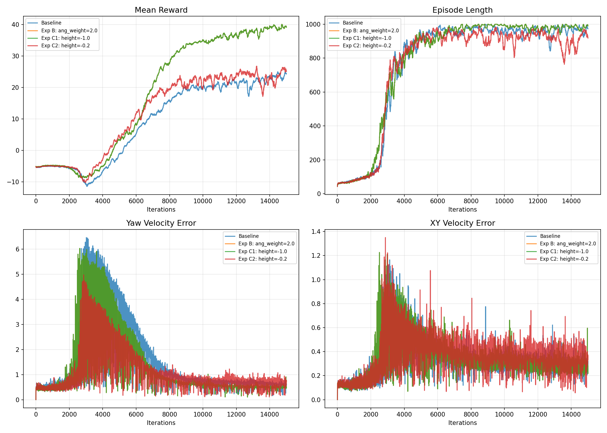

# Project 01: H1人形机器人 Locomotion Reward优化

## 项目简介

基于 IsaacLab 2.3.2 + Isaac Sim 5.1.0 平台，使用 PPO 算法训练宇树 H1 人形机器人在平地上的行走任务。
通过分析默认配置的不足，进行了系统性的 reward 调优实验，最终将总奖励提升 68%，转向跟踪误差降低 20%。

## 环境信息

| 项目 | 配置 |
|------|------|
| GPU | NVIDIA RTX 4060 Laptop (8GB) |
| 系统 | Ubuntu 22.04 |
| 框架 | IsaacLab 2.3.2 + Isaac Sim 5.1.0 |
| 算法 | PPO (rsl-rl-lib 3.0.1) |
| 并行环境数 | 32 |
| 每组实验迭代次数 | 15000 |
| 单次训练时间 | ~1.5小时 |

## 问题发现

默认配置下训练完成后，观察到以下问题：

- **转向跟踪误差较大**：error_vel_yaw = 0.62，机器人对转向指令的跟踪能力不足
- **线速度跟踪仍有改善空间**：error_vel_xy = 0.32
- **躯干姿态缺乏约束**：默认配置没有对机器人的站立高度进行显式约束

## 实验设计

### 实验A：Baseline（默认配置）

使用 IsaacLab 自带的 H1 flat 环境默认参数，作为基准线。

### 实验B：提高转向跟踪权重

将 `track_ang_vel_z_exp` 的权重从 1.0 提高到 2.0，增强策略对转向指令的关注度。

**修改内容**：
```python
# 默认
track_ang_vel_z_exp = RewTerm(weight=1.0, ...)
# 修改后
track_ang_vel_z_exp = RewTerm(weight=2.0, ...)
```

### 实验C1：加入躯干高度惩罚（强权重）

在实验B的基础上，新增 `base_height_l2` reward 项，目标高度 0.98m，权重 -1.0。

```python
base_height = RewTerm(
    func=mdp.base_height_l2,
    weight=-1.0,
    params={"target_height": 0.98},
)
```

### 实验C2：加入躯干高度惩罚（弱权重）

发现C1权重过大导致性能下降后，将权重降低至 -0.2。

```python
base_height = RewTerm(
    func=mdp.base_height_l2,
    weight=-0.2,
    params={"target_height": 0.98},
)
```

## 实验结果

### 数据对比

| 指标 | Baseline | 实验B | 实验C1 | 实验C2 |
|------|----------|-------|--------|--------|
| Mean Reward | 24.32 | 39.17 | 25.13 | **40.93** |
| error_vel_yaw | 0.6171 | 0.4932 | 0.7328 | **0.5037** |
| error_vel_xy | 0.3200 | **0.2177** | 0.3642 | 0.3065 |
| 摔倒率 | 3.1% | 3.1% | 20.1% | **0%** |
| Episode Length | 973 | 990 | 919 | **992** |

### 训练曲线



## 分析与结论

### 1. 转向权重调优（实验B）

将转向跟踪权重从 1.0 提高到 2.0 后，转向误差下降 20%，线速度误差下降 32%，总奖励提升 61%。说明默认配置中转向 reward 的权重相对不足，提高后策略能更好地兼顾速度跟踪和转向控制。

### 2. Reward权重平衡的重要性（实验C1 vs C2）

这是本项目最有价值的发现。加入躯干高度惩罚时：

- **权重 -1.0（过强）**：摔倒率从 3% 飙升至 20%，所有指标全面下降。机器人为了维持高度牺牲了行走稳定性，且增加了学习难度。
- **权重 -0.2（适中）**：摔倒率降至 0%，总奖励达到所有实验中最高的 40.93，同时高度惩罚项 (-0.0013) 说明机器人保持了良好的直立姿态。

这证明了 reward shaping 中**各项权重的平衡比单项权重的大小更重要**。

### 3. 最佳配置

实验C2（转向权重 2.0 + 高度惩罚 -0.2）是最佳配置：
- 总奖励最高（40.93，比 baseline 提升 68%）
- 零摔倒
- 转向误差降低 18%
- 机器人保持良好的直立姿态

## 学到的经验

1. **Reward权重不是越大越好**：过强的惩罚会干扰其他reward项的学习
2. **系统性对比实验的重要性**：每次只改一个变量，才能明确因果关系
3. **训练曲线比最终数值更有价值**：从曲线中可以看到学习过程的稳定性差异

## 文件说明

```
project_01_locomotion/
├── README.md                        # 本文件
├── configs/
│   ├── baseline.py                  # 默认配置
│   ├── exp_b_ang_weight.py          # 实验B配置
│   ├── exp_c1_height_strong.py      # 实验C1配置
│   └── exp_c2_height_mild.py        # 实验C2配置（最佳）
├── results/
│   └── training_curves.png          # 训练曲线对比图
└── videos/
    └── exp_c2_best.mp4              # 最佳配置回放视频
```
### 回放演示（实验C2 最佳配置）


## 后续计划

- [ ] 课程学习：先平地训练，再迁移到复杂地形
- [ ] Project 02：SAC + 机械臂抓取任务
