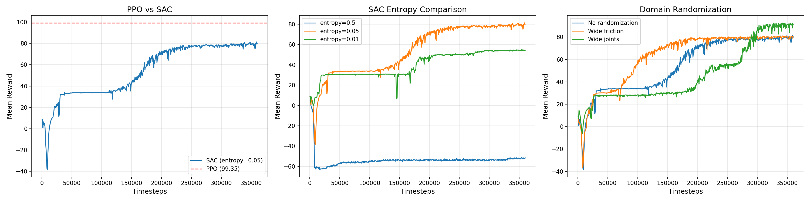

# 🤖 Project 02: Franka机械臂 Open Drawer 任务 — SAC算法调优与域随机化

## 📌 项目简介

基于 **IsaacLab 2.3.2 + Isaac Sim 5.1.0** 平台，使用 **SAC** 算法训练 Franka Panda 机械臂完成开抽屉（Open Drawer）任务。项目系统性地研究了 SAC 的 entropy 超参数对操作任务的影响，并通过域随机化验证策略的泛化能力。

🎯 **Part 1 — PPO vs SAC 对比**：PPO 达到 **99.35**，SAC 达到 **80.16**，分析了两种算法在操作任务上的学习特性差异

🎯 **Part 2 — SAC Entropy 超参数分析**：entropy 从 0.5 到 0.01 的三组对比，发现 **0.05 为最优值**，过高（-51.61）或过低（54.44）均显著降低性能

🎯 **Part 3 — 域随机化**：摩擦系数随机化后性能几乎不变（79.97），关节随机化反而提升至 **90.99**（超越 baseline），揭示了随机化对 SAC 探索的正向作用

> 📝 **背景说明**：本项目最初基于 Lift（抓取抬起）任务设计，但在实验中发现 Isaac Sim 5.1.0 存在已知的夹爪物理缺陷（[Issue #3072](https://github.com/isaac-sim/IsaacLab/issues/3072)），导致所有算法均无法完成完整的抓取-抬起动作。经过分析后迁移到 Open Drawer 任务，该任务不依赖夹爪抓取物理，能够充分验证 SAC 算法的能力。这一问题排查过程本身也展示了对仿真平台的深入理解。

---

## 🖥️ 环境信息

| 项目 | 配置 |
|------|------|
| GPU | NVIDIA RTX 4060 Laptop (8GB) |
| 系统 | Ubuntu 22.04 |
| 框架 | IsaacLab 2.3.2 + Isaac Sim 5.1.0 |
| 算法 | SAC (skrl 2.0.0) / PPO (rsl-rl-lib 3.0.1) |
| 机器人 | Franka Panda (7DOF + 平行夹爪) |
| 任务 | Isaac-Open-Drawer-Franka-v0 |
| 并行环境数 | 32 (SAC) / 256 (PPO) |
| 单次训练时间 | ~1.5 小时 (SAC) / ~25 分钟 (PPO) |

---

## 任务描述

机械臂需要完成：**接近抽屉把手 → 对齐末端 → 抓握把手 → 拉开抽屉** 的完整操作流程。

- **观测空间** (31维)：关节位姿(9) + 关节速度(9) + 抽屉关节位置(1) + 抽屉关节速度(1) + 末端到把手距离(3) + 上次动作(8)
- **动作空间** (8维)：7个关节位置 + 1个夹爪开合
- **Reward 设计**（9项，多阶段引导）：

| Reward 项 | 权重 | 作用 |
|-----------|------|------|
| approach_ee_handle | 2.0 | 末端接近把手 |
| align_ee_handle | 0.5 | 末端对齐把手方向 |
| approach_gripper_handle | 5.0 | 夹爪接近把手 |
| align_grasp_around_handle | 0.125 | 夹爪围绕把手对齐 |
| grasp_handle | 0.5 | 抓握把手 |
| open_drawer_bonus | 7.5 | 抽屉被打开的奖励 |
| multi_stage_open_drawer | 1.0 | 多阶段开抽屉 |
| action_rate_l2 | -0.01 | 动作平滑性惩罚 |
| joint_vel | -0.0001 | 关节速度惩罚 |

---

## Part 1：PPO vs SAC 对比

### 🧪 实验设计

使用相同的环境配置，分别用 PPO 和 SAC 训练，对比学习效率和最终性能。

| 算法 | 框架 | 并行环境数 | 训练量 |
|------|------|-----------|--------|
| PPO | rsl-rl-lib 3.0.1 | 256 | 5000 iterations |
| SAC | skrl 2.0.0 | 32 | 360,000 timesteps |

### 📊 实验结果

| 指标 | PPO | SAC |
|------|-----|-----|
| 最终 Mean Reward | **99.35** | **80.16** |
| 收敛速度 | ~333 iteration 达到 97 | ~240k steps 达到 79 |
| 学习曲线特征 | 快速收敛，几乎阶跃式 | 平滑渐进上升 |
| open_drawer_bonus | 5.64 | — |
| approach_ee_handle | 3.95 | — |

### 训练曲线

<p align="center">
  
</p>

### 💡 关键发现

#### ⭐ 发现一：PPO 在操作任务上收敛更快，但 SAC 学习更稳定

PPO 仅用 333 iteration 就从 0.82 飙升到 97.79，呈现阶跃式收敛。SAC 则从 8.82 平滑上升到 80.16，没有任何波动或崩塌。这反映了两种算法的本质差异：

- **PPO（on-policy）**：每次用当前策略的新数据更新，方向明确，收敛快，但依赖大量并行环境（256个）来保证样本多样性
- **SAC（off-policy）**：用 replay buffer 中的历史数据反复学习，sample efficiency 更高但需要更多 wall-clock 时间来收敛

---

## Part 2：SAC Entropy 超参数分析

### 🔍 问题背景

SAC 的核心创新是 **entropy 正则化**：策略不仅要最大化 reward，还要保持动作的多样性（高 entropy）。`initial_entropy_value` 控制了探索和利用的平衡。

### 🧪 实验设计

固定其他参数，仅改变 `initial_entropy_value`，观察对学习效果的影响。

```python
# SAC 配置中的关键参数
"learn_entropy": True,           # 自动调节 entropy 系数
"initial_entropy_value": 0.05,   # ← 实验变量
```

### 📊 实验结果

| Entropy 初始值 | 最终 Mean Reward | 学习特征 |
|---------------|-----------------|---------|
| 0.5（高探索） | **-51.61** | ❌ 策略崩溃，动作过于随机 |
| **0.05（适中）** | **80.16** | ✅ 🏆 稳步上升，最佳平衡 |
| 0.01（低探索） | **54.44** | ⚠️ 中途陷入局部最优（144k步掉至15），后恢复 |

### 💡 关键发现

#### ⭐ 发现二：Entropy 是 SAC 在操作任务中最敏感的超参数

三组实验呈现教科书级的"倒U型"关系：

- **Entropy 过高（0.5）**：策略接近随机动作，完全无法学习。动作空间是 8 维连续控制，过高的 entropy 让每个关节都在随机抖动
- **Entropy 过低（0.01）**：策略过早收敛到局部最优。训练曲线在 144k 步时突然从 30 掉到 15，说明陷入了次优解，后来虽然恢复但最终仍不如 0.05
- **Entropy 适中（0.05）**：平滑稳定上升，兼顾了探索和利用

> 📝 这与 Project 01 中"reward 权重平衡"的发现一脉相承——RL 中的超参数不是越大越好或越小越好，而是需要找到合理的平衡点。

---

## Part 3：域随机化实验

### 🎯 实验目标

验证 SAC 策略在不同物理条件下的鲁棒性，为 sim-to-real 迁移做准备。

### 🧪 实验设计

| 实验 | 随机化内容 | 范围 |
|------|-----------|------|
| 无随机化 (baseline) | 默认配置 | 摩擦 0.8-1.25，关节 ±0.1 |
| 宽摩擦随机化 | 机器人 + 抽屉把手摩擦系数 | 0.4-2.0（范围扩大 5 倍） |
| 宽关节随机化 | 机器人关节初始位置 | ±0.3（范围扩大 3 倍） |

```python
# 宽摩擦随机化
"static_friction_range": (0.4, 2.0),   # 默认 (0.8, 1.25)
"dynamic_friction_range": (0.4, 2.0),  # 默认 (0.8, 1.25)

# 宽关节随机化
"position_range": (-0.3, 0.3),         # 默认 (-0.1, 0.1)
```

### 📊 实验结果

| 实验 | Mean Reward | 相对 baseline |
|------|------------|--------------|
| 🟢 无随机化 | 80.16 | 100% |
| 🟡 宽摩擦随机化 | **79.97** | 99.8% |
| 🔵 宽关节随机化 | **90.99** | **113.5%** 🏆 |

### 💡 关键发现

#### ⭐ 发现三：SAC 对摩擦系数变化具有天然鲁棒性

摩擦范围扩大 5 倍后，性能几乎不变（80.16 → 79.97，仅下降 0.2%）。说明 SAC 学到的策略不依赖特定的摩擦条件，这对 sim-to-real 迁移非常有利。

#### ⭐ 发现四：关节随机化可以提升 SAC 的最终性能

这是最意外的发现——关节初始位置随机化范围扩大 3 倍后，reward 反而从 80.16 **提升到 90.99**（+13.5%）。可能的解释：

1. **更大的初始位置随机化 = 更丰富的探索起点**，弥补了 SAC 在低 entropy (0.05) 下探索不足的问题
2. **类似于课程学习的效果**——多样的初始状态迫使策略学习更通用的运动技能，而不是只记住从一个固定初始位置出发的轨迹

> 📝 这一发现与 Part 2 的 entropy 分析形成互补：entropy=0.05 时行为空间的探索有限，但通过状态空间的随机化（关节初始位置）弥补了这一不足。这提示我们：**SAC 的探索不仅可以通过 entropy 调节，还可以通过环境随机化来增强**。

---

## 📊 全部实验汇总

| # | 实验 | 算法 | 关键配置 | Mean Reward | 核心发现 |
|---|------|------|---------|------------|---------|
| 1 | PPO baseline | PPO | 默认 | **99.35** | 收敛极快 |
| 2 | SAC baseline | SAC | entropy=0.05 | **80.16** | 稳步上升 |
| 3 | SAC 高 entropy | SAC | entropy=0.5 | -51.61 | 过度探索崩溃 |
| 4 | SAC 低 entropy | SAC | entropy=0.01 | 54.44 | 探索不足 |
| 5 | SAC 宽摩擦随机化 | SAC | 摩擦 0.4-2.0 | 79.97 | 天然鲁棒 |
| 6 | SAC 宽关节随机化 | SAC | 关节 ±0.3 | **90.99** | 🏆 随机化提升性能 |

---

## 📝 总结：核心经验

| # | 经验 | 来源 | 与 Project 01 的联系 |
|---|------|------|---------------------|
| 1️⃣ | **PPO 收敛快但 SAC 学习更稳定** | Part 1 对比 | 从单一算法扩展到多算法对比分析 |
| 2️⃣ | **Entropy 是 SAC 最敏感的超参数，存在最优平衡点** | Part 2 entropy 实验 | 延续 Project 01 "权重平衡"的思路 |
| 3️⃣ | **SAC 对摩擦变化天然鲁棒** | Part 3 摩擦随机化 | 为 sim-to-real 提供实验依据 |
| 4️⃣ | **状态空间随机化可以弥补低 entropy 的探索不足** | Part 3 关节随机化 | 发现了 entropy 和域随机化的互补关系 |

---

## 📁 文件说明

```
project_02_manipulation/
├── README.md                            # 本文件
├── src/
│   ├── train_sac_clean.py               # ⭐ SAC训练脚本（含域随机化支持）
│   ├── play_sac.py                      # SAC回放脚本
│   ├── cabinet_env_cfg.py               # Open Drawer 环境配置
│   ├── lift_env_cfg.py                  # Lift 任务环境配置（早期实验）
│   ├── joint_pos_env_cfg.py             # Franka 关节位置控制配置
│   └── rewards.py                       # Reward 函数实现
├── configs/
│   ├── sac_baseline.yaml                # SAC 基础配置
│   ├── entropy_comparison.yaml          # Entropy 对比实验参数
│   └── domain_randomization.yaml        # 域随机化参数
├── results/
│   └── training_curves.png              # 所有实验训练曲线
└── videos/
    └── sac_open_drawer.mp4              # SAC 开抽屉回放视频
```

### 📖 代码阅读指南

| 顺序 | 文件 | 重点 |
|------|------|------|
| 1️⃣ | `src/train_sac_clean.py` | ⭐ SAC 模型定义、超参数配置、域随机化实现 |
| 2️⃣ | `src/cabinet_env_cfg.py` | Open Drawer 环境：observation / reward / event 配置 |
| 3️⃣ | `src/play_sac.py` | 加载 checkpoint 回放已训练的策略 |
| 4️⃣ | `configs/*.yaml` | 各实验的超参数记录 |

---

## 🚀 训练与回放命令

```bash
# PPO baseline (rsl-rl)
python scripts/reinforcement_learning/rsl_rl/train.py \
    --task Isaac-Open-Drawer-Franka-v0 --num_envs 256 --headless --max_iterations 5000

# SAC baseline (skrl)
python scripts/reinforcement_learning/skrl/train_sac_clean.py \
    --task Isaac-Open-Drawer-Franka-v0 --num_envs 32 --headless \
    --max_iterations 360000 --experiment_name drawer_sac_baseline

# SAC + 域随机化（宽关节）
python scripts/reinforcement_learning/skrl/train_sac_clean.py \
    --task Isaac-Open-Drawer-Franka-v0 --num_envs 32 --headless \
    --max_iterations 360000 --experiment_name drawer_sac_wide_joints --domain_rand wide_joints

# 回放最佳模型
python scripts/reinforcement_learning/skrl/play_sac.py \
    --task Isaac-Open-Drawer-Franka-v0 --num_envs 4 \
    --checkpoint logs/skrl_sac/drawer_sac_wide_joints/checkpoints/best_agent.pt
```

---

## 🔍 附录：Lift 任务实验记录

在迁移到 Open Drawer 任务之前，本项目在 Lift（抓取抬起）任务上进行了大量实验，积累了重要的经验：

| 发现 | 说明 |
|------|------|
| 课程学习与 SAC 冲突 | reward 权重递增机制与 SAC 的 entropy 正则化冲突，导致 reward 从 +0.7 暴跌至 -350 |
| Reward Hacking | 初版 grasp reward 被机器人"钻空子"——靠近物体+合夹爪就得高分(48.16)，但没有抬起物体 |
| Isaac Sim 5.1 物理缺陷 | 发现夹爪无法可靠抓取物体，为已知 bug（[Issue #3072](https://github.com/isaac-sim/IsaacLab/issues/3072)） |

这些经验直接指导了 Open Drawer 任务的实验设计，特别是 entropy 调优和域随机化的方案。
